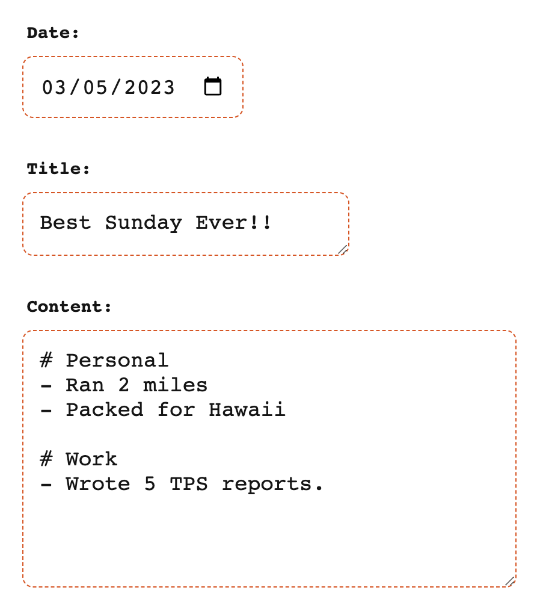

---

`Recorda.Day` makes it easy to record simple, daily notes. It was designed to be a fast, works on any platform, 5-minute-journal-ish webapp. It could also be a to-do list or anything else you want it to be. You can host it yourself or sign up for your own account at [https://recorda.day](https://recorda.day).

# About [recorda.day](https://recorda.day)
- Django based web app
- Hosted on a cheap Digital Ocean Droplet
- Postgres database
- [Gunicorn](https://gunicorn.org/) for the http server
- [caddy](https://caddyserver.com/docs/quick-starts/reverse-proxy) for reverse proxy & certificates.
- Testing with `pytest` and the following plugins: `pytest-randomly`, `pytest-xdist`, `pytest-django`, `pytest-cov`
- Why not Docker? There is a solo developer and it was hard to find solid information on how best to serve the site through Docker on a VPS instead of a PaaS.
- Why not PaaS? First, cost... Hosting two low traffic sites and a Postgres database would cost $20+/mo on a PaaS. (Not even including hosting static and media files on S2). I can host two low traffic project sites and Postgres on a $5/mo server.

# Using Recorda.Day
This is what the main editor looks like:

The editor page relies on [htmx](https://htmx.org/) to provide some convenience functions on this page.
- Selecting a new date will replace the current form and it's data with the same for the selected date.
- Edits to the title or content fields are auto-saved 1s after a key-up change in the form fields.